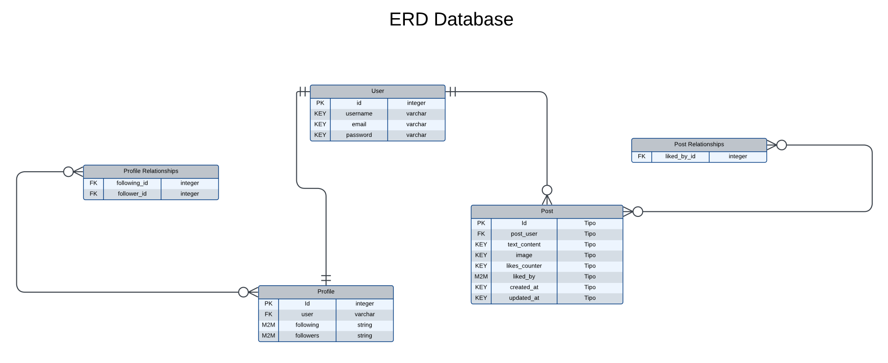
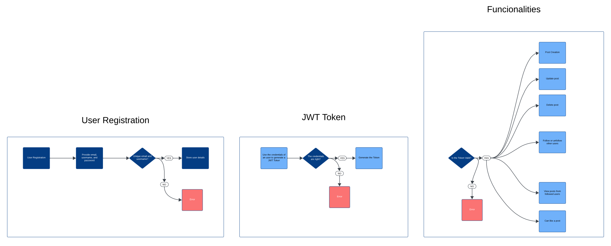

# Mini-Twitter

**Mini-Twitter** is a simplified social platform where users can post messages, follow others, and interact through likes and comments, demonstrating core web development skills.

## System Design Diagrams

### ERD Database Diagram

This diagram shows the database structure for Mini-Twitter, highlighting the tables and relationships among them.



### Architecture Diagram

This architecture diagram explains the system design of Mini-Twitter, outlining how the different components interact.




## Authentication

To use the API, you need to create a user account with the following requirements:

- **Username**: Unique
- **Email**: Unique and must be in a valid email format
- **Password**: Must be at least 8 characters long, contain at least one uppercase letter, and one special character

Once you have created a user, you can obtain a token by accessing the "create token" route with your username and password. This will generate two tokens: a refresh token and an access token. 

To authorize requests in Swagger, click the "Authorize" button and enter the access token as follows:

## API Endpoints

### User Management

- **Create User**
  - **Description**: Create a new user account by providing a username, email, and password.
  
- **List Users**
  - **Description**: Retrieve a list of other users.

- **Follow User**
  - **Description**: Follow another user by passing their user ID.

- **Unfollow User**
  - **Description**: Unfollow a currently followed user by passing their user ID.

- **Get User Details**
  - **Description**: Retrieve detailed information about a specific user.

- **Delete User**
  - **Description**: Delete your user account.

### Post Management

As a user, you can create, list, detail, update, and delete your posts.

- **Create Post**
  - **Description**: Create a new post.

- **List Posts**
  - **Description**: Retrieve a list of your posts.

- **Get Post Details**
  - **Description**: Retrieve detailed information about a specific post.

- **Update Post**
  - **Description**: Update an existing post.

- **Delete Post**
  - **Description**: Delete a specific post.

### Feed

- **Get Feed**
  - **Description**: View posts from users you follow, ordered by posting time.

## Documentation

You can find the full API documentation at the following URL:

**API Documentation**: [Swagger UI](http://127.0.0.1:8000/swagger/)


## How to Run the Project
To run Mini-Twitter using Docker, follow the steps below:

### Prerequisites

Make sure you have [Docker](https://www.docker.com/get-started) and [Docker Compose](https://docs.docker.com/compose/) installed on your machine.

### Instructions

1. **Clone the repository:**
      ```bash
      git clone https://github.com/JoaoPedroCavalcanti/mini-twitter/edit/main/README.md
          cd mini-twitter
      ```
  
2. **Build and start the containers:**
      ```bash
         docker-compose up --build
      ```
      

  
  ### Running Tests
  
  To run the project's tests, you can use the test service defined in your `docker-compose.yml` file. Run the following command:
  
      
  ```bash
  docker-compose run test
  ```
      
  
  ### Test Coverage
  
  To generate a test coverage report, you can utilize the `coverage` tool included in your setup. It will run automatically when you execute the test service. The coverage report will be displayed in the terminal.
  
  
  To view the HTML coverage report, navigate to the `htmlcov` directory generated after the tests have run. Open `index.html` in a browser to view the detailed report.
  
  ### Stopping the Containers
  
  To stop the containers, run:
      ```bash
      docker-compose down
      ```


